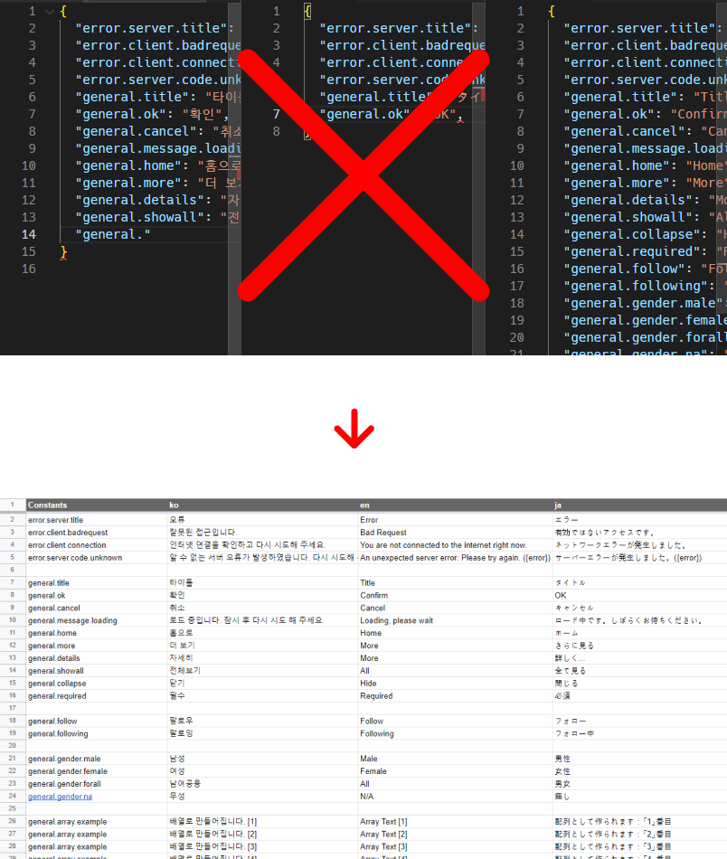

# i18n with Google SpreadSheet

[한국어](./README_ko.md)
[日本語](./README_ja.md)

This script will generate single or multiple json file(s) which managed by Google SpreadSheet (csv) file.

Advantages with managing Google SpreadSheet:
- Co-working with multiple translators.
- Powerful SpreadSheet functions can be used when you manage language sheet files.
- No JSON(or another format w/o formatting tool) Grammar Errors.
- Automatically update language file(s) by custom script when you build or deploy project.



# Example
First, you can see example file on here: https://docs.google.com/spreadsheets/d/1SVrzDQBLD72GAtxoCPad7sJTzuDnnTJ3arOrD_ADack/edit#gid=0


You can download or clone this repository and just run:
```
npm install

node index.js target=1SVrzDQBLD72GAtxoCPad7sJTzuDnnTJ3arOrD_ADack lang=ko,en,ja output=result
```
OR
```
yarn

node index.js target=1SVrzDQBLD72GAtxoCPad7sJTzuDnnTJ3arOrD_ADack lang=ko,en,ja output=result
```

*This script uses `axios` and `csv-parser`. You can just run `npm install` or `yarn` to install it.*

# Get Started
1. Place `index.js` into your project or anywhere you want
2. run `node index.js` and add parameters like below:

## Parameters
### target
Google SpreadSheet ID which you can see from address bar on your browser.

https://docs.google.com/spreadsheets/d/1SVrzDQBLD72GAtxoCPad7sJTzuDnnTJ3arOrD_ADack/edit#gid=0

For example, you can use the token `1SVrzDQBLD72GAtxoCPad7sJTzuDnnTJ3arOrD_ADack` on this URL (after `/d/` and before `/edit`).

`target=<GOOGLE SPREADSHEET ID>`

**Be careful: You need to set permission at least `Viewer` for all who have sheet URL.**

### gid
The sheet ID if you have multiple sheets on your Google SpreadSheet File. Default value is `0`.

You can find this value on your Google SpreadSheet URL starting after `#gid=`.

`gid=<GOOGLE SPREADSHEET's SHEET ID>`

### lang
Target languages. You can add multiple languages seperated by comma(`,`).
**this parameter will be ignored if you add `nuxt` parameter with value `true`**

`lang=<LANG,LANG1,LANG2 ...>`

Example:
`lang=ko,en,ja`

### output
Output (json) path. Default value is `./`.

`output=<OUTPUT PATH>`

## Parameters (nuxt.js)
This parameters only available if you're using nuxt.js.

### nuxt
If you want to load config files from nuxt.config.js, first you need to make flag `nuxt` to `true`

**`lang` parameter will be ignored if you add this parameter with value `true`**

Example:
`nuxt=true`

### config
nuxt.config.js path. default value is `./nuxt.config.js`.

Example:
`config=./nuxt.config.js`


# Special rules
## Same keys(Constants) on language sheet
The script generates an array if language sheet have same keys.

For example if you have 5 items which defined key name by `general.array.example`, on json file you can see an array which named by `general.array.example`, and the array will have 5 items


# LICENSE
MIT
