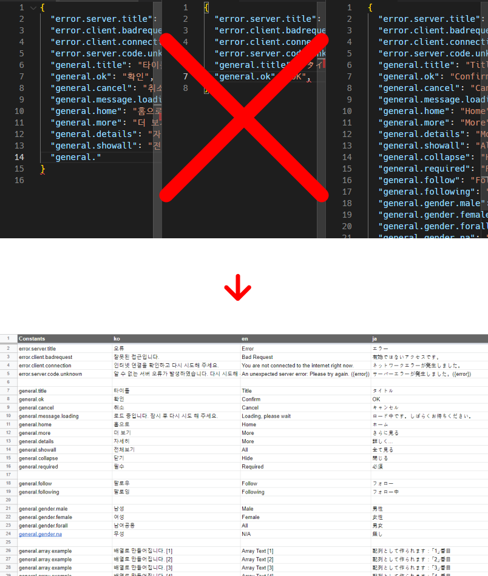

# i18n with Google SpreadSheet

Google SpreadSheet(구글 스프레드시트)로 다국어 대응 언어 파일을 관리 해 보세요.
이 스크립트는 구글 스프레드시트로 입력된 다국어 엑셀 파일을 CSV로 내보낸 뒤 json 파일로 변환 해 줍니다.

구글 스프레드시트를 사용하여 관리할 때 생기는 이점:
- 여러 명 (물론 혼자여도 좋습니다)과 번역 작업을 할 때 편합니다.
- 번역 내용을 검수하고 수정하는 데에도 역시 유용합니다.
- 기존 엑셀 프로그램이 가지고 있는 편하고 강력한 기능들을 모두 사용할 수 있습니다!
- JSON 혹은 기타 언어 파일을 직접 수정할 때 생기는 문법 오류나 시행착오가 없습니다!
- 기타 커스텀 스크립트를 직접 작성하여 빌드 시 혹은 디플로이 시 언어 파일을 자동으로 업데이트하도록 할 수도 있습니다!



# 예제
먼저 구글 스프레드시트로 작성된 예제 파일을 이 곳에서 볼 수 있습니다:
https://docs.google.com/spreadsheets/d/1SVrzDQBLD72GAtxoCPad7sJTzuDnnTJ3arOrD_ADack/edit#gid=0

이 레포지토리를 Clone하거나 다운로드한 다음, 다음 명령어를 실행 해 보세요:
```
npm install

node index.js target=1SVrzDQBLD72GAtxoCPad7sJTzuDnnTJ3arOrD_ADack lang=ko,en,ja output=result
```

만약 Yarn을 사용하고 싶다면 사용하셔도 무관합니다!

```
yarn

node index.js target=1SVrzDQBLD72GAtxoCPad7sJTzuDnnTJ3arOrD_ADack lang=ko,en,ja output=result
```

*이 스크립트는 axios 및 csv-parser를 사용하므로 사전에 설치되어 있어야 합니다. npm install 혹은 yarn 명령어를 통해 설치하세요.*

# 시작하기
1. `index.js` 파일을 프로젝트 내 혹은 원하시는 곳에 배치하세요.
2. `node index.js` 파일을 아래 파라메터를 필요에 따라 붙여 실행하세요.

## 파라메터 일람
### target
구글 스프레드시트 ID값입니다. (브라우저 주소에서 찾을 수 있습니다)

https://docs.google.com/spreadsheets/d/1SVrzDQBLD72GAtxoCPad7sJTzuDnnTJ3arOrD_ADack/edit#gid=0

예를 들면, 위 주소에서 `1SVrzDQBLD72GAtxoCPad7sJTzuDnnTJ3arOrD_ADack` 와 같은 영문자 및 숫자로 구성된 토큰을 찾을 수 있습니다. (`/d/` 뒤 및 `/edit` 앞)

`target=<GOOGLE SPREADSHEET ID>`

**주의: 스크립트가 파일을 불러오려면 파일의 공개 상태가 적어도 `링크가 있는 사용자에게 보기 권한`(뷰어) 이 있어야 합니다.**

### gid
구글 스프레드시트에서 관리 중인 시트가 여러개일 때 특정 시트를 지정하기 위해 사용합니다.
URL에서 `#gid=` 뒤에 붙는 이름으로 찾을 수 있습니다.
기본값은 `0` 입니다.


`gid=<GOOGLE SPREADSHEET's SHEET ID>`

### lang
파일을 생성할 번역 언어 대상 배열입니다. 여러개일 경우 ','로 구분합니다.
**`nuxt` 파라메터를 `true`로 설정 한 경우 이 값은 무시됩니다.**

`lang=<LANG,LANG1,LANG2 ...>`

예시:
`lang=ko,en,ja`

### output
출력 (json)이 저장될 경로입니다. 기본값은 `./` 입니다.

`output=<OUTPUT PATH>`

## 파라메터 일람 (nuxt.js)
nuxt.js를 사용하는 경우에만 해당되는 파라메터들입니다.

### nuxt
설정 파일을 nuxt.config.js로부터 자동으로 불러오기를 원하시면 이 파라메터를 설정하시면 됩니다.

**이 파라메터를 `true`로 설정하는 경우, `lang` 파라메터는 무시됩니다.**

예시:
`nuxt=true`


### config
nuxt.config.js 경로입니다. 기본값: `./nuxt.config.js`.

예시:
`config=./nuxt.config.js`


# 기타
## 언어 번역 시트에 같은 키가 여러 개 있는 경우
이 스크립트에서는 같은 키가 번역 시트에 여러개 있는 경우, 배열로 만들어 출력합니다.

예를 들면, `general.array.example` 라는 키가 5개 정의된 경우 json 파일에서 `general.array.example` 라는 이름을 가진 배열에 5개의 번역 텍스트가 담기게 됩니다.


# LICENSE
MIT
